# Customer Segmentation using K-Means Clustering

This project focuses on segmenting customers based on their purchasing behavior using unsupervised machine learning. The goal is to identify distinct customer groups to support data-driven marketing strategies and enhance customer understanding.

---

## Objective

- To segment customers into distinct clusters based on their transaction behavior.
- To analyze customer purchasing patterns through Exploratory Data Analysis (EDA).
- To utilize clustering for targeted marketing and strategic decision-making.

---

## Dataset Overview

Two datasets were merged using the `Order ID` column:

1. **Sales Data**
   - Columns: `Order ID`, `Amount`, `Profit`, `Quantity`, `Category`, `Sub-Category`

2. **Customer Data**
   - Columns: `Order ID`, `Order Date`, `CustomerName`, `State`, `City`

---

## Tools and Libraries Used

- Python
- Pandas, NumPy
- Matplotlib, Seaborn
- Scikit-learn

---

## Workflow

### 1. Data Cleaning
- Parsed `Order Date` to datetime format.
- Merged both datasets using an inner join on `Order ID`.
- Removed duplicates and handled missing values.

---

### 2. Exploratory Data Analysis (EDA)

#### 2.1 Univariate Analysis
- Distribution plots to understand the spread and skewness.

**Amount Distribution**
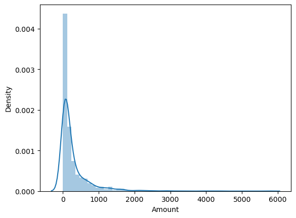

**Profit Distribution**
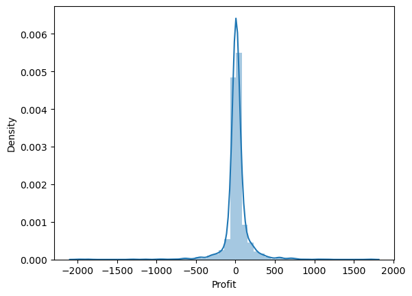

**Quantity Distribution**
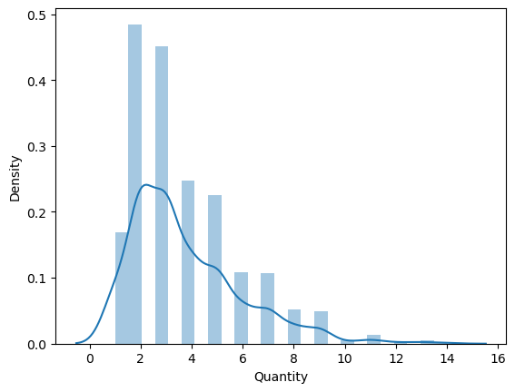

---

#### 2.2 Bivariate Analysis

**Quantity vs Profit (with regression)**
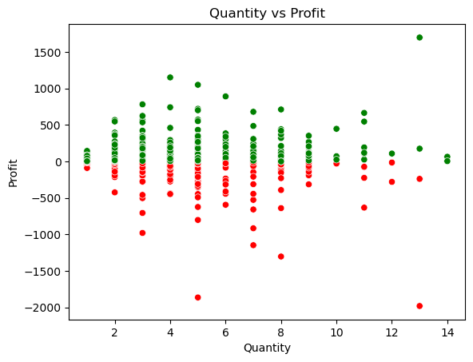

**Sub-Category vs Profit (Point Plot)**
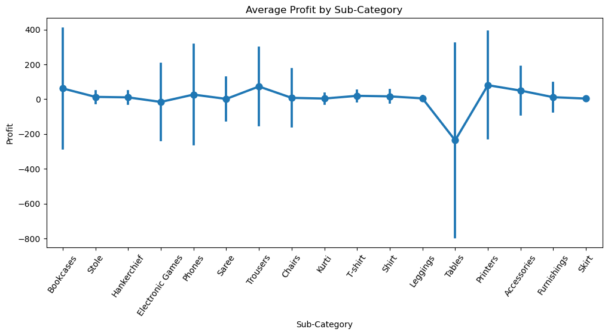

**Treemap of Sub-Category Sales**
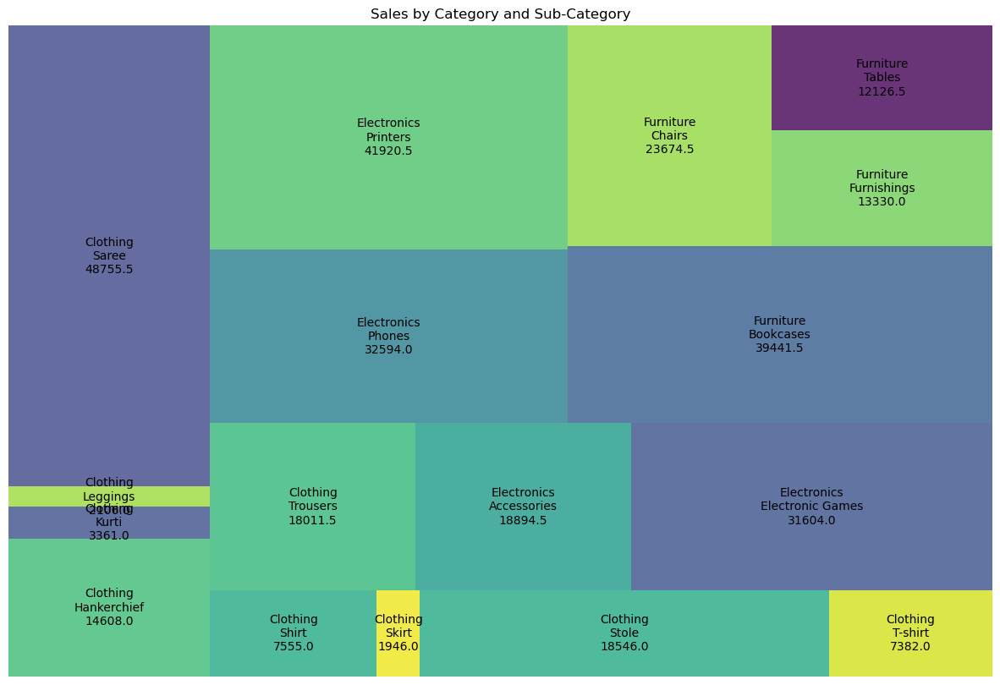

**Swarm Plot: Quantity by Category**
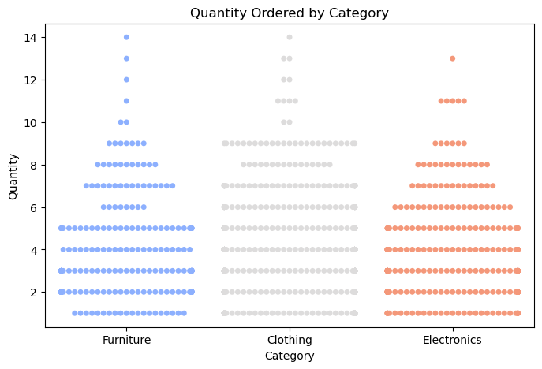

**Violin Plot: Amount by Category**
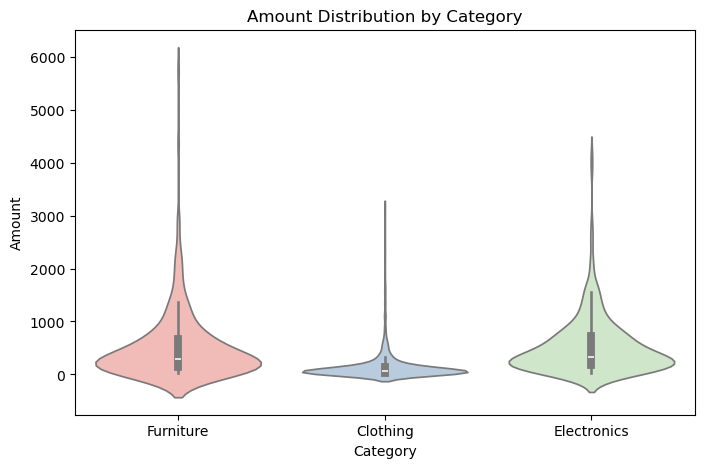

---

#### 2.3 Time Series Analysis

**Monthly Sales Trend**
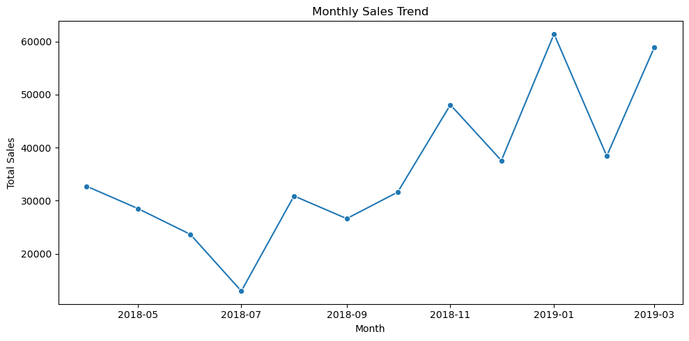

**Daily Profit Trend**
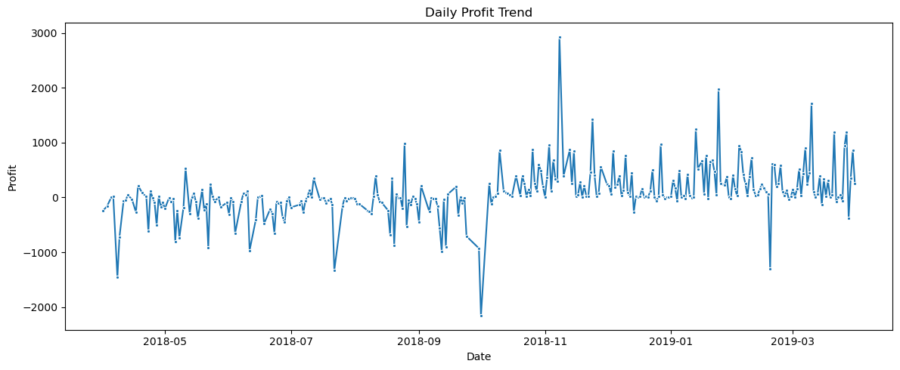

---

## 3. Data Preprocessing

### 3.1 Outlier Treatment
- Outliers removed using Z-Score and IQR methods from `Amount`, `Profit`, and `Quantity`.

### 3.2 Feature Scaling
- StandardScaler was applied to:
  - `Total_Amount`
  - `Total_Profit`
  - `Total_Quantity`

---

## 4. Feature Engineering

- Aggregated transactional data at **customer level**.
- Created new features:
  - `Total_Amount`
  - `Total_Profit`
  - `Total_Quantity`

---

## 5. Optimal K Selection

- Elbow Method used to find the best value for `k` (number of clusters).

**Elbow Curve**
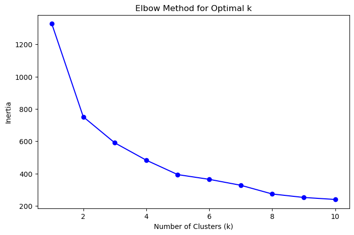

---

## 6. K-Means Clustering

- Applied K-Means clustering with optimal value of `k`.
- Scaled data was used to train the clustering model.

---

## 7. Cluster Analysis

**Customer Segments Visualization**
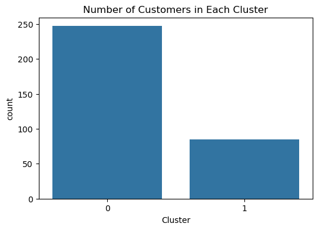

- Each cluster represents a different group of customers:
  - High spenders
  - Moderate customers
  - Low-value or dormant customers

---

## Key Findings

- Most customers belong to one of three segments with distinct spending behavior.
- One segment showed low engagement and profitability, highlighting scope for re-engagement campaigns.
- Sales and profits have a monthly trend, peaking during certain months, useful for seasonal marketing planning.

---

## Author

**Harsh Agarwal**  
Final Year B.Tech Student – Computer Science & Engineering  
Arya College of Engineering and IT, Jaipur  
GitHub: [harshaga819](https://github.com/harshaga819)  
LinkedIn: [linkedin.com/in/harshaga819](https://www.linkedin.com/in/harshaga819)
